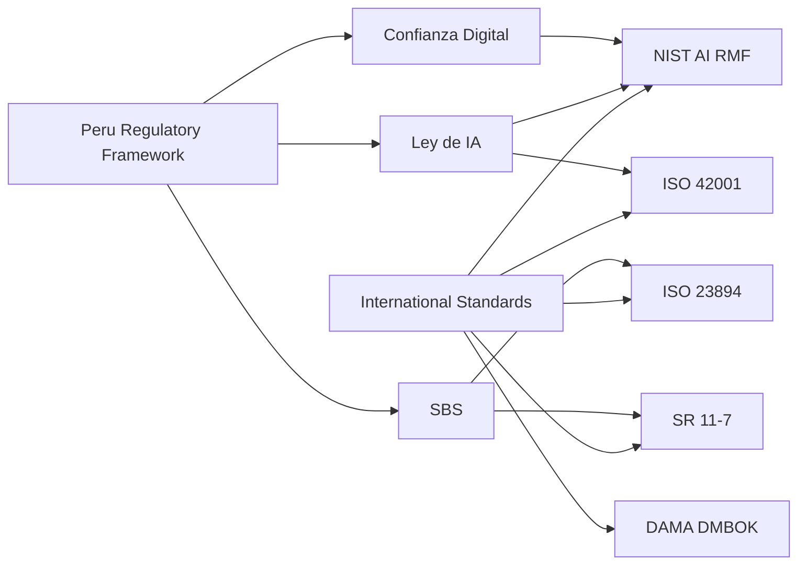

# Regulatory Framework Mapping

```mermaid
flowchart LR

PERU[Peru Regulatory Framework]

PERU --> SBS[SBS]
PERU --> AI[Ley de IA]
PERU --> TRUST[Confianza Digital]

INT[International Standards]

INT --> NIST[NIST AI RMF]
INT --> ISO42001[ISO 42001]
INT --> ISO23894[ISO 23894]
INT --> SR117[SR 11-7]
INT --> DAMA[DAMA DMBOK]

SBS --> SR117
SBS --> ISO23894

AI --> ISO42001
AI --> NIST

TRUST --> NIST
```